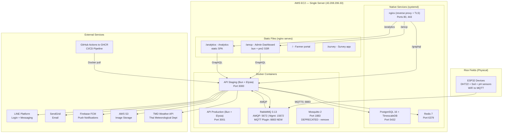
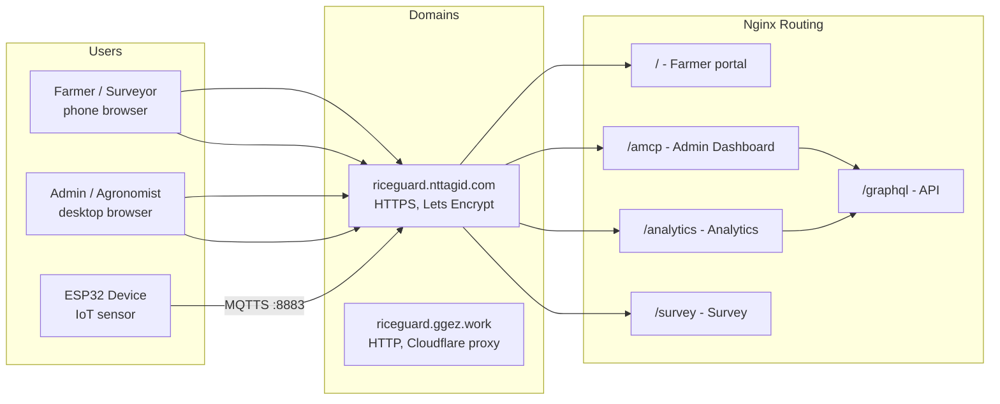
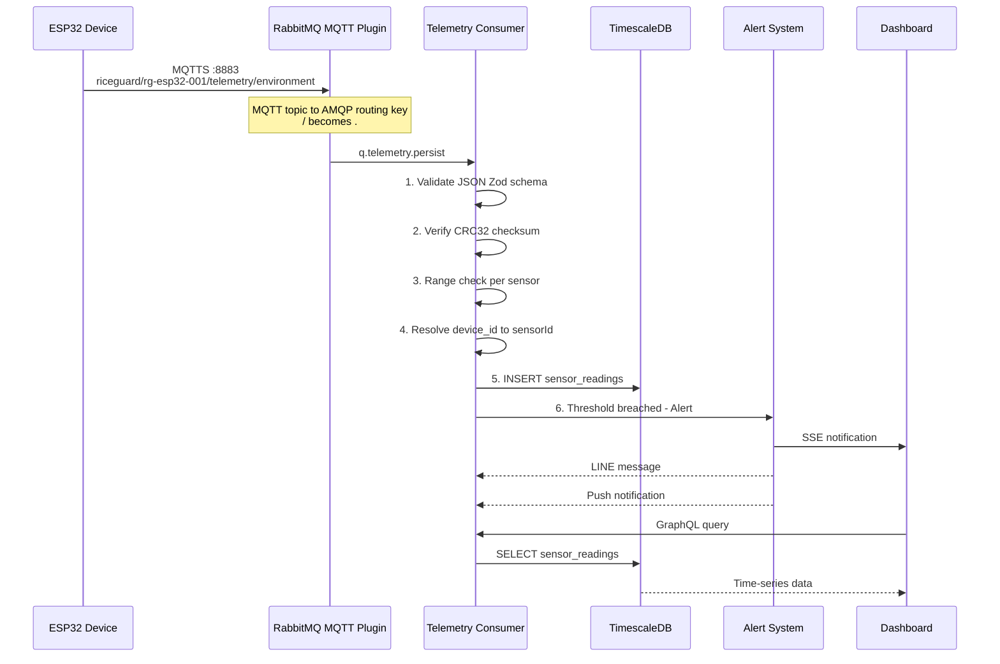
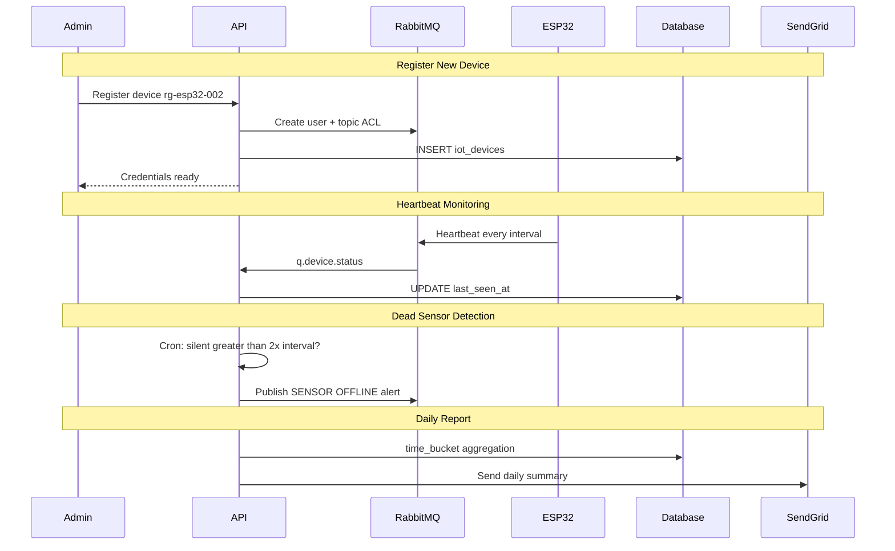
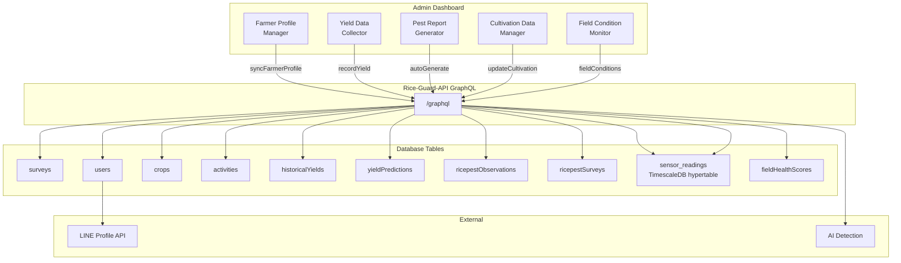
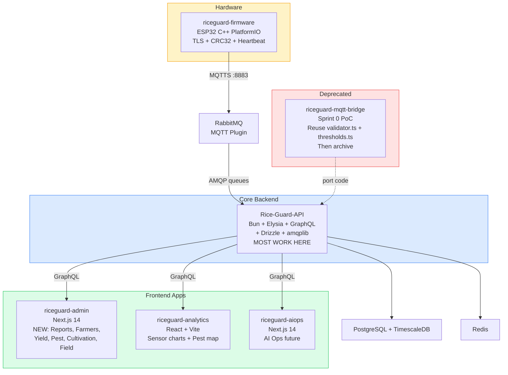
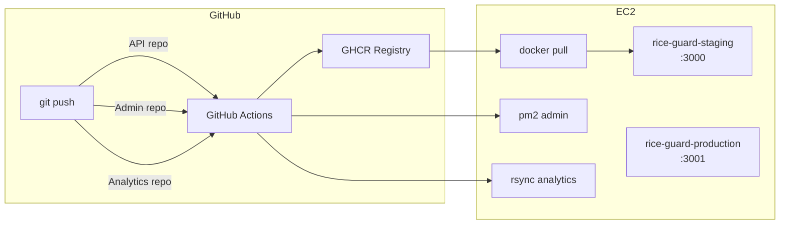

# RIC-158/159/160 — RiceGuard Full Research & System Diagrams

> **Created**: 2026-04-06 | **Author**: Artemis (with research from Claude Code)  
> **Purpose**: Complete analysis of 3 Jira tickets + 6 repositories + infrastructure + implementation plan  
> **Audience**: IT and non-IT team members

---

## Table of Contents

1. [Executive Summary](#executive-summary)
2. [The 3 Jira Tickets](#the-3-jira-tickets)
3. [The 6 Repositories](#the-6-repositories)
4. [System Diagrams (Mermaid)](#system-diagrams)
5. [Implementation Plan](#implementation-plan)
6. [Database Changes](#database-changes)
7. [Verification Checklist](#verification-checklist)

---

## Executive Summary

RiceGuard is a Thai rice farming IoT platform. **One EC2 server** hosts everything — the API, database, message broker, and all frontend apps. ESP32 sensors in rice fields send environmental data over WiFi/MQTT, which gets stored in TimescaleDB and displayed on admin/analytics dashboards.

**The big change**: The old architecture used Mosquitto (MQTT broker) + a separate Bun bridge service. The new architecture **removes both** — ESP32 connects directly to RabbitMQ (which has an MQTT plugin), and the API consumes messages directly via AMQP.

```
OLD:  ESP32 → Mosquitto → Bun Bridge → API → TimescaleDB
NEW:  ESP32 → RabbitMQ MQTT Plugin → API Consumer → TimescaleDB
```

**Build order**: RIC-158 (Sensor Ingestion) → RIC-159 (Data Sync) → RIC-160 (Farm Data)

### Infrastructure Status (Updated 2026-04-06)

Kwang has deployed RabbitMQ MQTT infrastructure on staging. Ready for consumer development.

| Component | Staging | Production |
|-----------|---------|------------|
| **AMQP** | `localhost:5673` | `localhost:5672` |
| **Management UI** | `localhost:15673` | `localhost:15672` |

**Queues already created on staging**:

| Queue | Binding (amq.topic) | Purpose |
|-------|---------------------|---------|
| `q.telemetry.persist` | `riceguard.*.telemetry.#` | Sensor readings → validate → TimescaleDB |
| `q.device.status` | `riceguard.*.status.#` | Heartbeat → device health tracking |
| `q.telemetry.dlx` | (dead-letter) | Failed messages after 3x nack |

**Dead-letter policy**: nack 3 times → auto dead-letter to `q.telemetry.dlx`

> Source: @Kwang message to @Ittipol — see RIC-158 Jira for payload + consumer example

---

## The 3 Jira Tickets

### RIC-158: Sensor Data Ingestion Pipeline (Section 2.4)
**Status**: In Progress | **Assignee**: Ittipol (Fiez) | **Priority**: Build First

**What**: Receive sensor data from ESP32 devices via RabbitMQ MQTT Plugin, validate it, and store in TimescaleDB.

**7 Modules**:

| # | Module | Status | Description |
|---|--------|--------|-------------|
| 2.4.1 | Sensor Reading Scheduler | To Do | Configurable reading interval (3s demo / 4hr production) |
| 2.4.2 | Multi-depth Soil Moisture | To Do | 3 depth levels (5cm, 15cm, 30cm) |
| 2.4.3 | Environmental Sensor Manager | To Do | pH, light, rain, wind sensors |
| 2.4.4 | Data Validation Module | To Do | Server-side range check, spike detection |
| 2.4.5 | Packet Creation System | **Done** | ArduinoJson payload builder |
| 2.4.6 | Checksum Generator | To Do | CRC32 firmware + API verification |
| 2.4.7 | Error Handling | To Do | Dead sensor detection, drift alert |

**Key Architecture**:
```
ESP32 --MQTTS :8883--> RabbitMQ (MQTT Plugin, amq.topic exchange)
                          |
                          +-> q.telemetry.persist --> Consumer --> TimescaleDB
                          +-> q.telemetry.aiml ----> (future AI/ML)
                          +-> q.device.status -----> Device health tracking
```

---

### RIC-159: Data Sync — Edge-Cloud Synchronization (Section 2.5 Part 1)
**Status**: In Progress | **Assignee**: Ittipol (Fiez) | **Depends on**: RIC-158

**What**: Device authentication, connection monitoring, batch data upload, report generation.

**5 Modules**:

| # | Module | Description |
|---|--------|-------------|
| 2.5.1 | Data Sync Manager | Batch sync every 4hr + immediate critical alerts |
| 2.5.7 | Authentication System | RabbitMQ device credentials + topic ACL per device |
| 2.5.8 | Connection Monitor | Health check, auto-reconnect, offline detection |
| 2.5.9 | Data Upload Service | Batch upload via consumer, retry on failure |
| 2.5.10 | Report Generation | Daily/weekly sensor summaries, email via SendGrid |

**Device Auth**: Each ESP32 gets a unique RabbitMQ username/password. Topic ACL restricts to `riceguard.{device_id}.*` only — one device can't impersonate another.

---

### RIC-160: Farm Data Management (Section 2.5 Part 2)
**Status**: In Progress | **Assignee**: Ittipol (Fiez) | **Depends on**: RIC-158

**What**: Manage farmer profiles, yield data, pest reports, cultivation records, field conditions.

**5 Modules**:

| # | Module | Description |
|---|--------|-------------|
| 2.5.2 | Farmer Profile Manager | Sync survey data + LINE profile into unified profile |
| 2.5.3 | Yield Data Collector | Record actual yield, compare with AI predictions |
| 2.5.4 | Pest Report Generator | Auto-generate reports from sensor anomalies + AI |
| 2.5.5 | Cultivation Data Manager | Track planting method, rice variety, schedule |
| 2.5.6 | Field Condition Monitor | Aggregate sensor data per farm zone |

**What already exists in the database**: `farms`, `crops`, `surveys`, `ricepestSurveys`, `ricepestObservations`, `fieldHealthScores`, `yieldPredictions` tables.

---

## The 6 Repositories

| # | Repository | Tech Stack | Role | Relevance to RIC-158/159/160 |
|---|-----------|-----------|------|------------------------------|
| 1 | **Rice-Guard-API** | Bun + Elysia + GraphQL + Drizzle | Core backend | **Most work here** — new consumers, services, GraphQL schema |
| 2 | **riceguard-admin** | Next.js 14 (App Router) | Admin dashboard | New pages for RIC-159 reports + RIC-160 farm data |
| 3 | **riceguard-analytics** | React 19 + Vite | Analytics dashboard | Consumes sensor data from RIC-158 |
| 4 | **riceguard-aiops** | Next.js 14 | AI Ops dashboard | Future ML pipeline — low priority now |
| 5 | **riceguard-firmware** | C++ (ESP32/PlatformIO) | IoT firmware | TLS to RabbitMQ, CRC32, heartbeat |
| 6 | **riceguard-mqtt-bridge** | Bun + Mosquitto | ~~Sprint 0 PoC~~ | **DEPRECATED** — reuse `validator.ts` and `thresholds.ts`, then archive |

---

## System Diagrams

### 1. Physical Infrastructure — Where Everything Lives

> Everything runs on **one EC2 server** (43.208.206.33) in AWS Jakarta.



#### What lives on the EC2 server? (Plain English)

**One machine (43.208.206.33) runs everything.** No Kubernetes, no separate database server. Here's every service:

| Layer | Service | How it runs | Port | What it does |
|-------|---------|-------------|------|-------------|
| **Database** | PostgreSQL 16 + TimescaleDB | systemd (native, not Docker) | 5432 | Stores ALL data — farms, crops, sensors, users, alerts |
| **Cache** | Redis 7 | systemd (native) | 6379 | Cache, sessions, pub-sub |
| **Reverse Proxy** | nginx | systemd (native) | 80, 443 | Routes traffic by URL path to the right service |
| **API (staging)** | Rice-Guard-API | Docker container | 3000 | Bun + Elysia + GraphQL — the core backend |
| **API (production)** | Rice-Guard-API | Docker container | 3001 | Same app, different config |
| **Message Broker** | RabbitMQ 3.13 | Docker container | 5672 (AMQP) / 5673 (staging) / 8883 (MQTT) | Post office for IoT messages |
| **MQTT (old)** | Mosquitto 2 | Docker container | 1883 | **DEPRECATED** — to be removed |
| **Admin Dashboard** | riceguard-admin | bun + pm2 (not Docker) | via nginx `/amcp` | Next.js 14, SSR |
| **Analytics** | riceguard-analytics | static files | via nginx `/analytics` | React + Vite SPA |
| **Farmer Portal** | — | static files | via nginx `/` | Farmer-facing app |
| **Survey App** | — | static files | via nginx `/survey` | Survey data collection |

**External services (NOT on this server)**:
- **LINE Platform** — Login + messaging
- **SendGrid** — Email delivery
- **Firebase FCM** — Push notifications
- **AWS S3** — Image storage
- **TMD Weather API** — Thai Meteorological Department weather data
- **GitHub Actions → GHCR** — CI/CD pipeline builds Docker images

### 2. Domain Routing — How Users Access the System



### 3. Data Flow — Sensor to Dashboard (RIC-158)



### 4. Data Flow — Device Auth and Health (RIC-159)



### 5. Data Flow — Farm Data Management (RIC-160)



### 6. Repository Dependency Map



### 7. CI/CD Deployment Pipeline



---

## Implementation Plan

### Phase 1: RIC-158 — Sensor Data Ingestion (Build First)

| Step | Module | What to Build | Which Repo |
|------|--------|--------------|------------|
| 1.0 | **RabbitMQ Topology** | Declare new queues `q.telemetry.persist`, `q.device.status` with `amq.topic` bindings | Rice-Guard-API |
| 1.1 | **Validation** | Port Zod schemas from mqtt-bridge, add CRC32 + depth_cm fields | Rice-Guard-API |
| 1.2 | **Thresholds** | Port alert threshold logic, extend to all 9 sensor types | Rice-Guard-API |
| 1.3 | **Checksum** | CRC32 verification using `Bun.CRC32` | Rice-Guard-API |
| 1.4 | **Device Registry** | DB lookup: device_id + sensor_type to sensorId | Rice-Guard-API |
| 1.5 | **Telemetry Consumer** | validate to CRC32 to range check to batch insert to alert | Rice-Guard-API |
| 1.6 | **Device Status Consumer** | Track last_seen, uptime, wifi_rssi | Rice-Guard-API |
| 1.7 | **Dead Sensor Cron** | Alert when device silent greater than 2x interval | Rice-Guard-API |
| 1.8 | **DB Migration** | Add `iot_devices` table, `device_id`/`depth_cm`/`last_seen_at` columns | Rice-Guard-API |
| 1.9 | **Firmware Update** | TLS to RabbitMQ :8883, CRC32 in payload, heartbeat in loop | riceguard-firmware |

### Phase 2: RIC-159 — Data Sync (After RIC-158)

| Step | Module | What to Build | Which Repo |
|------|--------|--------------|------------|
| 2.1 | **Device Auth** | RabbitMQ Management API: create user per device with topic ACL | Rice-Guard-API |
| 2.2 | **Connection Monitor** | RSSI trends, degradation detection | Rice-Guard-API |
| 2.3 | **Batch Upload** | Chunked batch insert, idempotent dedup | Rice-Guard-API |
| 2.4 | **Sync Manager** | Track sync state, alert on missed windows | Rice-Guard-API |
| 2.5 | **Report Generator** | Daily/weekly aggregation + email via SendGrid | Rice-Guard-API |
| 2.6 | **Report GraphQL** | Queries + mutations for reports | Rice-Guard-API |
| 2.7 | **Report UI** | Report viewer page | riceguard-admin |

### Phase 3: RIC-160 — Farm Data (After RIC-158)

| Step | Module | What to Build | Which Repo |
|------|--------|--------------|------------|
| 3.1 | **Farmer Profile** | Sync survey + LINE data, GraphQL mutations | Rice-Guard-API + admin |
| 3.2 | **Yield Data** | Actual vs predicted, CRUD | Rice-Guard-API + admin |
| 3.3 | **Pest Report** | Auto-gen from sensor anomalies + AI detection | Rice-Guard-API + admin |
| 3.4 | **Cultivation** | Planting method, variety, dates | Rice-Guard-API + admin |
| 3.5 | **Field Condition** | Aggregate sensor data per zone | Rice-Guard-API + admin |
| 3.6 | **Admin Pages** | 5 new dashboard pages | riceguard-admin |

---

## Database Changes

```sql
-- RIC-158: New table for device management
CREATE TABLE iot_devices (
  id UUID PRIMARY KEY DEFAULT gen_random_uuid(),
  device_id VARCHAR(50) UNIQUE NOT NULL,   -- e.g. "rg-esp32-001"
  farm_id UUID REFERENCES farms(id),
  firmware_version VARCHAR(20),
  last_seen_at TIMESTAMPTZ,
  expected_interval_seconds INT DEFAULT 14400,  -- 4 hours
  status VARCHAR(20) DEFAULT 'active',
  created_at TIMESTAMPTZ DEFAULT NOW()
);

-- RIC-158: Link sensors to devices
ALTER TABLE sensors ADD COLUMN device_id VARCHAR(50) REFERENCES iot_devices(device_id);

-- RIC-158: Multi-depth soil moisture
ALTER TABLE sensor_readings ADD COLUMN depth_cm INT;  -- NULL for non-depth sensors

-- RIC-158: Dead sensor detection
ALTER TABLE sensors ADD COLUMN last_seen_at TIMESTAMPTZ;
```

---

## Verification Checklist

### RIC-158
- [ ] RabbitMQ MQTT plugin enabled, port 8883 listening
- [ ] Publish test MQTT message to consumer inserts to `sensor_readings`
- [ ] Invalid payload rejected (nack + log, no DB insert)
- [ ] Wrong CRC32 rejected
- [ ] Stop heartbeats triggers dead-sensor alert after 2x interval
- [ ] Soil moisture with depth_cm 5/15/30 stored correctly
- [ ] ESP32 firmware connects to RabbitMQ :8883

### RIC-159
- [ ] Register device creates RabbitMQ user with topic ACL
- [ ] Disconnect device triggers offline alert within 2x interval
- [ ] 100-reading burst batch insert succeeds
- [ ] Daily report cron sends email via SendGrid
- [ ] Reports visible in admin dashboard

### RIC-160
- [ ] Farmer profile syncs with survey + LINE data
- [ ] Yield data entry compares with AI prediction
- [ ] Pest reports auto-generate from anomalies
- [ ] Cultivation data updates crops table
- [ ] Field condition aggregation per zone displays correctly

---

## Key Files to Reuse (from deprecated mqtt-bridge)

| Source File | Port To | What |
|-------------|---------|------|
| `riceguard-mqtt-bridge/src/validator.ts` | `Rice-Guard-API/src/domains/telemetry/validator.ts` | Zod schemas for 9 sensor types |
| `riceguard-mqtt-bridge/src/thresholds.ts` | `Rice-Guard-API/src/domains/telemetry/thresholds.ts` | Alert threshold logic |

---

*Generated by Artemis Oracle — 2026-04-06*
